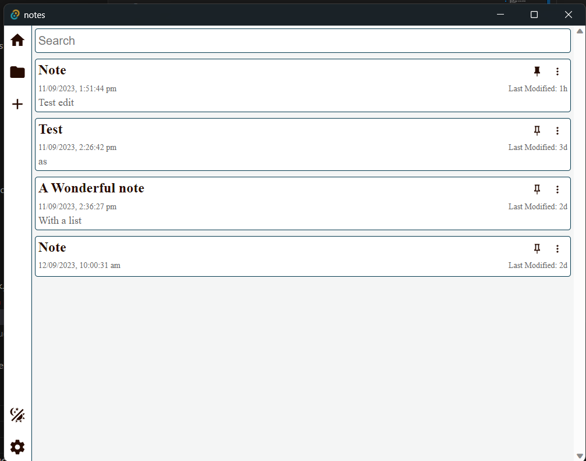
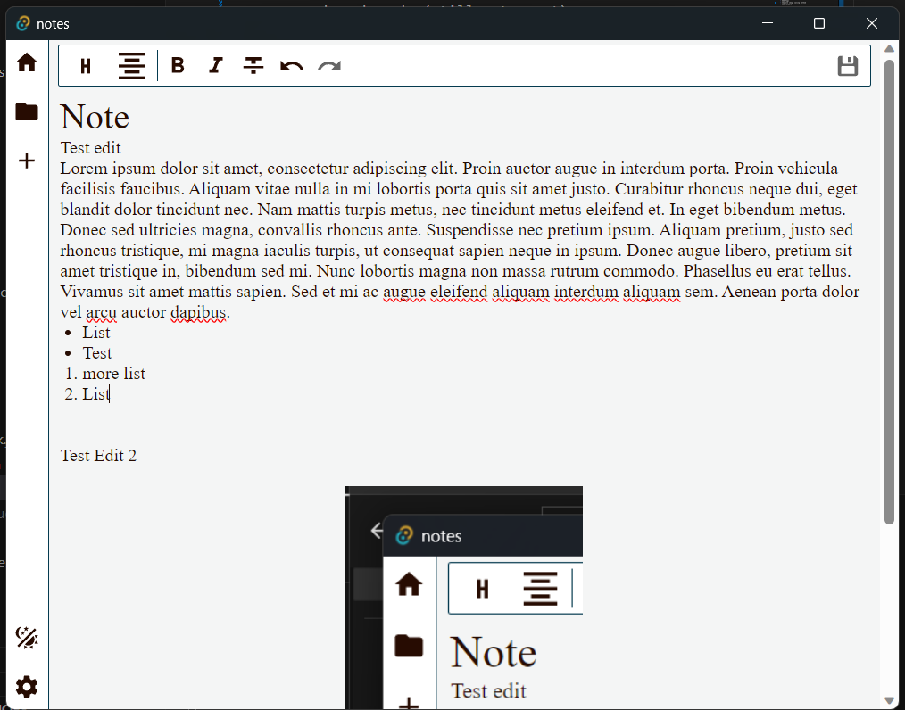
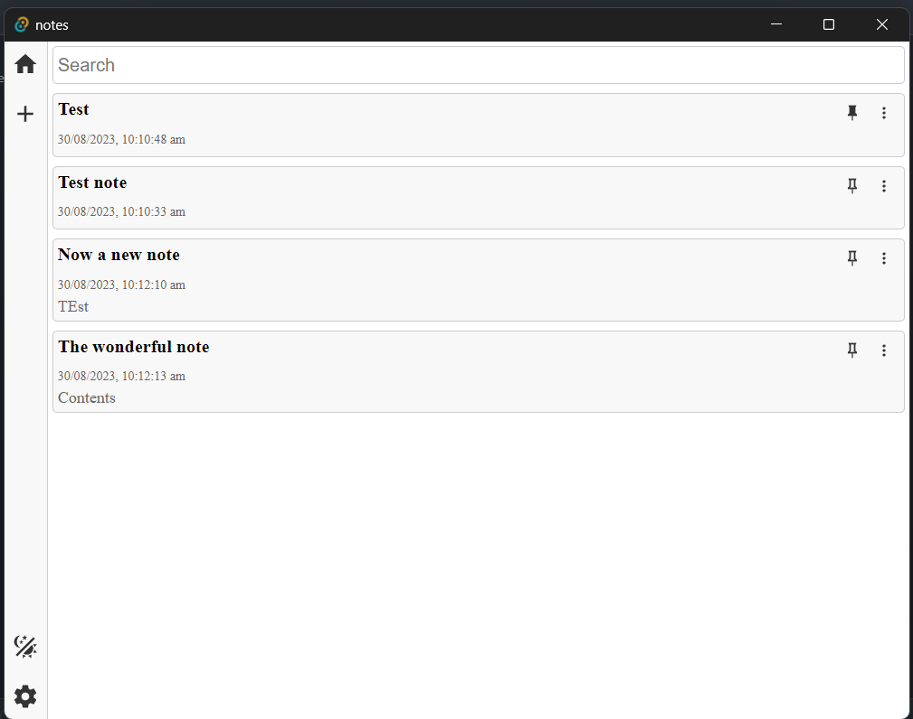
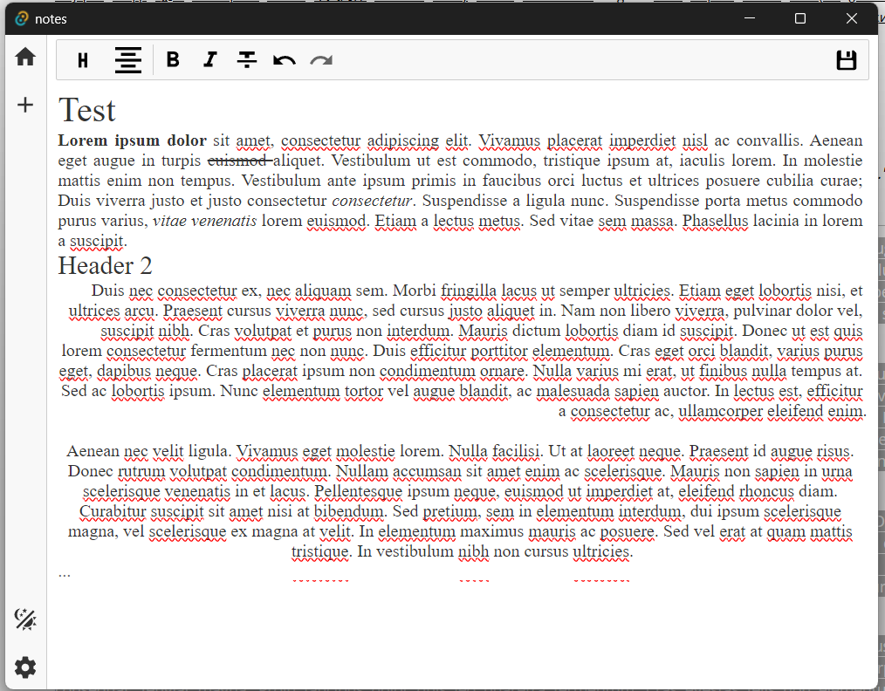

# Notes
This notes app is a very simple app inteneded to replace the default stick notes app in windows

## Features
### As of version 0.0.2
The app is in a useable state but still has some bugs and missing features
- Improved Dark Mode (Still not great)
- Added alot of missed features from version 0.0.1 including deleting notes, saving on ctrl+s, and more
- Added last modified date to notes
- Added Sort by last modified date by default

*Notes Home View*

 *Notes Editor View*

### As of version 0.0.1
**Version 0.0.1 is Not Completely Functional**

- Basic Dark Mode
- Simple Editor and saving
- Pin Notes
- Search Notes

 *Notes Home View*

 *Notes Editor View*

## Planned
- Improved dark mode
- Improved editor
- Add Tags 
- Improve image saving method
- Add Folders
